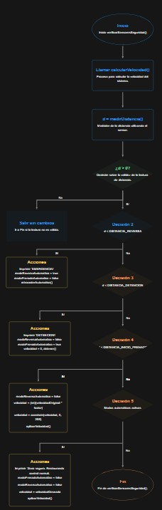

# Documentación de Diseño 
**Proyecto:**  Robot basado en microcontrolador  
**Versión:** 1.0  
**MCU:** ESP32

---

## 2. Arquitectura del software embebido

### 2.1 Módulos

En la arquitectura del software, se encuentran los siguientes módulos:

1. **Comunicación WiFi**
   - Configuración de la red mediante los parámetros de `ssid` y `password`.
   - Un servidor TCP (`WiFiServer server(9000)`).
   - Protocolo de comandos de texto con instrucciones como: FORWARD, BACKWARD y SPEED_SET.

2. **Control de motores (L298N)**
   - Pines digitales de dirección: `IN1`, `IN2`, `IN3`, `IN4`.
   - Canales PWM: `ENA` (usado para la traccióntracción), `ENB` (usado para la dirección).
   - Funciones de alto nivel:
     - `aplicarVelocidad()`
     - `detener()`
     - `avanzar()`
     - `retroceder()`
     - `retrocederAutomatico()`
     - `girarDerecha()`
     - `girarIzquierda()`
   - Estados de movimiento: `moviendoAdelante`, `moviendoAtras`, `girandoDerecha`, `girandoIzquierda`.

3. **Sensor de distancia (HC-SR04)**
   - Pines: `TRIG_PIN`, `ECHO_PIN`.
   - Interrupción `echo_ISR()` sobre flancos del pin ECHO.
   - Captura de tiempos `t_start`, `t_end` y bandera de finalización `pulseDone`.
   - Función de medición no bloqueante: `medirDistancia()`.

4. **Acelerómetro y Giroscopio (MPU6050)**
   - Interfaz I²C (`Wire.begin(22, 21)`).
   - Objeto `MPU6050 mpu`.
   - Cálculo de velocidad: `calcularVelocidad()`.

5. **Lógica de seguridad y control automático**
   - Parámetros:
     - Distancias umbral: `DISTANCIA_INICIO_FRENADO`, `DISTANCIA_DETENCION`, `DISTANCIA_REVERSA`.
     - Velocidad de reversa: `VELOCIDAD_REVERSA`.
   - Estados:
     - `modoFrenadoAutomatico`
     - `modoReversaAutomatica`
     - `velocidadDeseada`, `velocidadOriginal`, `velocidad` (PWM efectiva).
   - Función central: `verificarSensoresSeguridad()`.

6. **Timing**
   - Ticks de sistema con `millis()`:
     - `lastSensorCheck` para sensado/seguridad (cada 50 ms).
     - `lastSpeedUpdate` para telemetría de velocidad (cada 500 ms).

### 2.2 Diagramas de flujo del sistema

Diagrama de funcionamiento general

Diagrama de flujo del setup()

Diagrama de flujo del loop()

Diagrama de la verificación de sensores

## 2.3 Estrategias de gestión de E/S

### 2.3.1 Motores (salidas digitales y PWM)

**Dirección de tracción:**

- `IN1`, `IN2` controlan el sentido (adelante/atrás) del motor de tracción.

**Dirección de giro:**

- `IN3`, `IN4` controlan la dirección (izquierda/derecha) del motor de dirección.

**Magnitud de velocidad:**

- `ENA`: PWM para la tracción (`ledcWrite(ENA, velocidad)`).
- `ENB`: PWM fijo a `255` para la dirección (siempre máximo giro disponible).

El software abstrae el control mediante funciones de alto nivel:

- `avanzar()`
- `retroceder()`
- `girarDerecha()`
- `girarIzquierda()`
- `detener()`

Estas funciones consultan y/o actualizan estados de seguridad:

- `modoFrenadoAutomatico`
- `modoReversaAutomatica`

### 2.3.2 Sensor HC-SR04 (entrada digital + interrupciones)

**Lanzamiento del pulso:**

- `TRIG_PIN` se pone brevemente en `HIGH` para iniciar la medición (≈ 10 µs).

**Captura del eco con interrupción:**

- Interrupción `echo_ISR()` en los flancos de `ECHO_PIN`:
  - Flanco de subida: `t_start = micros()`.
  - Flanco de bajada: `t_end = micros(); pulseDone = true;`.

**Lectura no bloqueante:**

La función `medirDistancia()`:

1. Limpia la bandera: `pulseDone = false`.
2. Dispara el pulso en `TRIG`.
3. Espera con timeout controlado por `millis()` (máx. 50 ms).
4. Si `pulseDone == true`, calcula la distancia a partir de `t_end - t_start`.
5. Si hay timeout, retorna `-1` (lectura inválida).

Esta estrategia reduce la carga de CPU al no emplear `pulseIn()` (bloqueante) y permite seguir atendiendo otras tareas en el bucle principal.

### 2.3.3 Sensor MPU6050 (I²C)

- Se inicializa con:
  - `Wire.begin(22, 21)`
  - `mpu.initialize()`

La función `calcularVelocidad()`:

1. Lee las aceleraciones en ejes `X` e `Y`.
2. Calcula la magnitud lateral `accelMagnitud`.
3. Aplica:
   - Umbral de ruido (ignorando aceleraciones pequeñas).
   - Integración numérica:  
     `velocidad = velocidadAnterior + a * Δt`.
   - Filtro de amortiguamiento (multiplicación por `0.95`).
   - Reducción extra si el PWM es bajo (`velocidad < 50`).
   - Saturación de la velocidad al rango `[0, 200]`.

La velocidad resultante se usa para telemetría y, potencialmente, para futuras lógicas de control.

### 2.3.4 Interrupciones, prioridades y sincronización

#### Interrupción del HC-SR04

**ISR principal:**

- `void IRAM_ATTR echo_ISR();`

**Variables compartidas:**

- `volatile long t_start, t_end;`
- `volatile bool pulseDone;`

**Sincronización:**

- El bucle principal (`loop()`) y `verificarSensoresSeguridad()` leen `pulseDone` y los tiempos (`t_start`, `t_end`).
- `pulseDone` actúa como bandera para indicar que una medición está lista.
- El acceso es simple (lectura/escritura atómica sobre tipos primitivos), por lo que el riesgo de condiciones de carrera es mínimo en este contexto.

#### Priorización implícita

**Seguridad > Comandos del usuario**

- `verificarSensoresSeguridad()` se ejecuta periódicamente:
  - En el `loop()` general.
  - Dentro del bucle de atención al cliente TCP.

**Modos automáticos:**

- **Frenado automático** (`modoFrenadoAutomatico`):
  - Limita o lleva a cero la velocidad PWM.
  - Inhibe la ejecución de comandos de avance y giro.

- **Reversa automática** (`modoReversaAutomatica`):
  - Fuerza `retrocederAutomatico()` (con `IN2` activo y velocidad de reversa máxima).

**Excepción controlada:**

- El comando `BACKWARD` del usuario **siempre** se respeta:
  - Resetea `modoFrenadoAutomatico` y `modoReversaAutomatica`.
  - Ejecuta `retroceder()` aun cuando haya obstáculos cerca.

Esto permite al usuario sacar el vehículo de situaciones de bloqueo, asumiendo que conoce el entorno y los riesgos.

### 2.4 Protocolos de comunicación

#### 2.4.1 Pila de protocolos

- **Capa física/enlace:**  
  WiFi (IEEE 802.11, manejado por el stack del ESP32).

- **Capa de transporte:**  
  TCP (conexión orientada, fiable).

- **Capa de aplicación:**  
  Protocolo propio basado en líneas de texto ASCII.

#### 2.4.2 Protocolo de aplicación (definido en el código)

**Formato de mensajes**

- **Comandos desde el cliente:**
  - Línea ASCII terminada en `'\n'`.
  - El servidor usa `readStringUntil('\n')` para leer cada comando.

- **Respuestas / telemetría del ESP32:**
  - Líneas tipo:
    - `SPEED:<valor>` → velocidad estimada en cm/s, con 2 decimales.
    - `OK:<COMANDO>` → confirmaciones simples de comandos recibidos.

**Comandos soportados**

- `SPEED_SET:<0-255>`  
  Cambia `velocidadDeseada` (y `velocidad` si no hay modos automáticos activos).

- `SPEED_LOW`  
  Fija `velocidadDeseada = 150`.

- `SPEED_HIGH`  
  Fija `velocidadDeseada = 255`.

- `FORWARD`  
  Intenta avanzar (si no hay frenado/reversa automáticos activos).

- `BACKWARD`  
  Siempre ejecuta reversa (anula modos automáticos).

- `LEFT`, `RIGHT`  
  Giros si la lógica de seguridad lo permite.

- `STOP`  
  Detiene el vehículo.

- `GET_SPEED`  
  Solicita lectura inmediata de `velocidadActual`.

#### 2.4.3 Telemetría

- Cada **500 ms**, cuando hay un cliente conectado:
  - Se envía `SPEED:<velocidadActual>` de forma periódica.

- Después de algunos comandos (por ejemplo `SPEED_SET`):
  - Se responde también con una línea `SPEED:` actualizada, para facilitar *feedback* inmediato en la interfaz del usuario.

#### 2.4.4 Análisis comparativo de la solución de comunicación

##### TCP + protocolo de texto 

**Ventajas:**

- Fiabilidad (retransmisiones, orden de llegada garantizado por TCP).
- Implementación sencilla:
  - Lado embebido: lectura de líneas y estructura `if/else` por comando.
  - Lado cliente: puede ser cualquier lenguaje capaz de abrir un socket TCP.
- Flexibilidad para depuración:
  - Se puede probar desde un terminal TCP (`telnet`, `netcat`, etc.).

**Desventajas:**

- Overhead mayor que UDP, especialmente si la red tiene pérdida de paquetes.
- No incluye estructura de mensaje binaria por defecto (se está usando texto, con más bytes por parámetro).

### 2.5 Organización de memoria

En el entorno **ESP32 con Arduino**, la memoria de programa y de datos se organiza (a alto nivel) en:

- **Memoria de programa (Flash):**
  - Código compilado de:
    - Lógica de control de motores, seguridad y comunicaciones.
    - Bibliotecas (`WiFi`, `Wire`, `MPU6050`, etc.).

- **Memoria de datos (RAM):**
  - **Segmento de datos estáticos:**
    - Variables globales inicializadas (por ejemplo `ssid`, `password`, umbrales de distancia).
  - **Segmento BSS:**
    - Variables globales no inicializadas o inicializadas a cero (por ejemplo *flags*, tiempos, etc.).
  - **Stack:**
    - Variables locales de funciones (por ejemplo `comando` en el `loop()`, variables temporales en `calcularVelocidad()`).
  - **Heap:**
    - Usado internamente por librerías (por ejemplo `String`, `WiFi`, etc.).

El diseño evita el uso explícito de memoria dinámica por parte del usuario (no hay `new` / `malloc` en el código), lo cual simplifica el análisis de consumo de memoria y reduce el riesgo de fragmentación.

## 3. Aplicación de usuario y comunicación

### 3.1 Rol de la aplicación de usuario

La aplicación de usuario es una **aplicación de escritorio en Python** que actúa como panel de control remoto para el robot basado en ESP32. Su objetivo principal es:

- Permitir el **control manual de movimiento** (adelante, atrás, giro izquierdo/derecho, detener).
- Ajustar y monitorizar la **velocidad del carrito** (PWM y velocidad real estimada por el MPU6050).
- Supervisar en tiempo real el **estado de la comunicación** (latencia, pérdida de paquetes, ancho de banda).
- Visualizar **logs generados por el ESP32** (eventos de seguridad, cambios de velocidad, conexiones).
- Generar **alertas remotas** (por SMS vía Twilio) cuando se detectan colisiones.

Desde el punto de vista del sistema completo, la aplicación Python cumple el rol de **interfaz de usuario externa** y de **terminal de monitoreo**, conectándose al ESP32 mediante WiFi + TCP usando un protocolo de texto sencillo.

---

### 3.2 Arquitectura de la aplicación

La aplicación se diseñó con una arquitectura modular para facilitar el mantenimiento y la extensión futura. Los módulos principales son:

1. **`main.py` (punto de entrada)**
   - Contiene la función `main()`, que crea una instancia de `CarController` y llama a `app.run()`.
   - Mantiene el arranque del sistema desacoplado de los detalles internos de la GUI y la comunicación.

2. **`controller.py` (`CarController`)**
   - Es el **módulo orquestador** de la aplicación.
   - Coordina:
     - La lógica de negocio (qué hacer con cada comando del usuario).
     - La comunicación con el ESP32 (`ESP32Communication`).
     - La interfaz gráfica (`ControlGUI`).
     - El monitoreo de comunicación (`CommunicationMonitor`).
     - El subsistema de notificaciones (`TwilioNotifier`).
   - Implementa callbacks para:
     - Comandos de dirección (`handle_direction`).
     - Cambios de velocidad (`handle_speed`).
     - Conexión / desconexión (`handle_connect`, `handle_disconnect`).
   - Programa tareas periódicas usando `root.after()` de Tkinter:
     - Actualización de estadísticas de comunicación.
     - Solicitud periódica de logs al ESP32.

3. **`communication.py` (`ESP32Communication`)**
   - Encapsula toda la **lógica de sockets TCP** hacia el ESP32.
   - Permite:
     - Conectar / desconectar (`connect()`, `disconnect()`).
     - Enviar comandos de texto terminados en `\n` (`send_command()`).
     - Escuchar mensajes entrantes en un **hilo dedicado** (`_listen_for_messages()`).
   - Implementa callbacks hacia el controlador para:
     - Actualizaciones de velocidad (`speed_callback`).
     - Alertas de colisión (`collision_callback`).
     - Actualización de logs del ESP32 (`log_callback`).

4. **`gui.py` (`ControlGUI`)**
   - Implementa la **interfaz gráfica en Tkinter**.
   - Expone callbacks para que el controlador reciba eventos de usuario:
     - Botones de dirección (D-Pad).
     - Botones de velocidad.
     - Botones de conectar / desconectar.
   - Proporciona métodos para actualizar la vista:
     - `update_pwm_display()`, `update_speed_display()`.
     - `update_connection_status()`.
     - `update_statistics()` (latencia, confiabilidad, ancho de banda).
     - `add_log_message()` y `clear_log()` para el panel de eventos.

5. **`monitoring.py` (`CommunicationMonitor`)**
   - Lleva estadísticas de la comunicación:
     - Latencia actual, mínima, máxima y promedio.
     - Número de comandos enviados, respuestas recibidas y comandos fallidos.
     - Tasa de pérdida de paquetes y confiabilidad.
     - Bytes enviados/recibidos y ancho de banda estimado.
   - Mantiene un **log circular** de los últimos mensajes intercambiados.
   - Entrega un resumen consolidado mediante `get_statistics_summary()`, que se muestra en la GUI.

6. **`notifications.py` (`TwilioNotifier`)**
   - Implementa el envío de **SMS de alerta** usando la API de Twilio.
   - Se utiliza principalmente para notificar eventos de **colisión** detectados por el robot.
   - Incluye:
     - Inicialización del cliente Twilio a partir de credenciales almacenadas en variables de entorno.
     - Control de *cooldown* (`COLLISION_COOLDOWN`) para evitar spam de mensajes.

7. **`config.py`**
   - Centraliza toda la **configuración de la aplicación**:
     - IP y puerto del ESP32.
     - Parámetros de la ventana (título, tamaño, colores).
     - Valores de PWM para velocidades baja, alta y pasos de incremento/decremento.
     - Umbrales de latencia y pérdida de paquetes para advertencias.
     - Configuración de Twilio (SID, token y números de teléfono).
   - Permite modificar el comportamiento del sistema sin tocar la lógica de los módulos principales.

En conjunto, la arquitectura sigue un esquema cercano a **Modelo–Vista–Controlador (MVC)**:
- **Controlador**: `CarController`.
- **Vista**: `ControlGUI`.
- **Modelo / Servicios**: `ESP32Communication`, `CommunicationMonitor`, `TwilioNotifier` y la configuración en `config.py`.

---

### 3.3 Interfaz de usuario

La interfaz gráfica, implementada en Tkinter, se diseñó para que el control sea **intuitivo y rápido**, enfocado en la operación del carrito en tiempo real.

Las principales áreas de la GUI son:

1. **Panel de conexión**
   - Botón **“Conectar”** / **“Desconectar”**.
   - Indicador de estado (conectado / desconectado).
   - Mensajes emergentes (diálogos) de éxito o error de conexión.

2. **D-Pad de dirección**
   - Conjunto de botones:
     - ▲ Adelante (`FORWARD`)
     - ▼ Atrás (`BACKWARD`)
     - ◄ Izquierda (`LEFT`)
     - ► Derecha (`RIGHT`)
     - ■ Detener (`STOP`)
   - Soporta **control por teclado**:
     - Flechas del teclado para las direcciones.
     - Barra espaciadora para detener.
   - Cada pulsación se traduce en un comando que el controlador envía al ESP32.

3. **Control de velocidad**
   - Botones para:
     - **Velocidad baja** (🐌, comando `SPEED_LOW`).
     - **Velocidad alta** (🚀, comando `SPEED_HIGH`).
     - Aumentar y disminuir velocidad (`SPEED_UP`, `SPEED_DOWN`), que internamente se traducen en `SPEED_SET:<PWM>`.
   - Indicador numérico del **PWM actual** (`update_pwm_display()`).
   - La GUI refleja siempre el valor PWM que maneja el controlador (`current_pwm`).

4. **Panel de telemetría**
   - Muestra la **velocidad real estimada** por el MPU6050 (`velocidadActual` en cm/s), recibida desde el ESP32 mediante mensajes `SPEED:<valor>`.
   - Permite al usuario comparar:
     - Comando de velocidad (PWM).
     - Velocidad física estimada (cm/s).

5. **Panel de monitoreo de comunicación**
   - Estadísticas calculadas por `CommunicationMonitor`:
     - Latencia actual, mínima, máxima y promedio.
     - Tasa de pérdida de paquetes y porcentaje de confiabilidad.
     - Bytes enviados/recibidos y ancho de banda.
     - Tiempo total de conexión.
   - Estos datos se actualizan de forma periódica (cada `STATS_UPDATE_INTERVAL` ms) mediante el scheduler de la GUI (`root.after`).

6. **Panel de logs y eventos**
   - Muestra mensajes relevantes, como:
     - Conexión / desconexión de clientes.
     - Comandos enviados y respuestas del ESP32.
     - Eventos de seguridad: frenado automático, reversa automática, zona segura.
     - Logs descargados desde el robot (por ejemplo: "DETENCION! Obstaculo a 24.5cm").
   - La aplicación también guarda un archivo local `esp32_logs.json` para análisis posterior.

---

### 3.4 Protocolo de comunicación robot–aplicación

La comunicación entre la aplicación de usuario y el robot se basa en la pila:

- **WiFi** (ESP32 como Access Point `ESP32_Carrito`).
- **TCP** sobre el puerto configurado (por defecto, 80).
- **Protocolo de aplicación basado en texto** con líneas ASCII terminadas en `\n`.

Desde el punto de vista de la aplicación Python:

#### 3.4.1 Flujo de conexión

1. El usuario conecta su PC a la red WiFi creada por el ESP32.
2. Al pulsar **“Conectar”**, `CarController.handle_connect()`:
   - Inicializa estadísticas (`monitor.reset()`).
   - Intenta abrir un socket TCP con `ESP32Communication.connect()`.
   - Si la conexión es exitosa:
     - Se actualiza el estado de la GUI.
     - Se inicia un **hilo de escucha** (`_listen_for_messages()`).
     - Se envía un comando `GET_SPEED` para sincronizar la velocidad inicial mostrada.
3. Si la conexión falla, se notifica al usuario mediante un diálogo y se registra el error en el panel de log.

#### 3.4.2 Comandos enviados al robot

Los comandos se envían como cadenas de texto, por ejemplo:

- **Movimiento**  
  - `FORWARD`  
  - `BACKWARD`  
  - `LEFT`  
  - `RIGHT`  
  - `STOP`  

- **Velocidad**  
  - `SPEED_LOW` (PWM bajo predefinido).  
  - `SPEED_HIGH` (PWM alto predefinido).  
  - `SPEED_SET:<0-255>` para establecer un valor PWM exacto, usado al presionar “+”/“-” de velocidad.

- **Telemetría y logs**  
  - `GET_SPEED` para solicitar la velocidad actual.  
  - `GET_LOGS` para obtener los últimos logs generados por el ESP32 en formato JSON.

El módulo `ESP32Communication` se encarga de:

- Añadir el `\n` al final del mensaje.
- Evitar reenvíos redundantes del mismo comando (excepto `STOP`).
- Registrar cada envío en el monitor de comunicación.

#### 3.4.3 Mensajes recibidos desde el robot

El hilo `_listen_for_messages()` procesa las respuestas del ESP32:

- **Velocidad real**  
  - Mensajes del tipo `SPEED:<valor>`:
    - El valor se convierte a `float` y se pasa a `CarController._handle_speed_update()`.
    - La GUI actualiza el indicador de velocidad real en cm/s.

- **Alertas de colisión**  
  - Mensajes que contienen las palabras `COLISION` o `COLLISION`:
    - Activan el callback de colisión en el controlador (`_handle_collision_alert()`), que:
      - Envía inmediatamente `STOP`.
      - Registra el evento en el log visual.
      - Intenta enviar un SMS de alerta mediante Twilio.

- **Logs del ESP32**  
  - Mensajes que empiezan con `LOGS:` seguidos de un JSON con un arreglo de cadenas:
    - Se decodifica el JSON.
    - Se actualiza un buffer circular de logs en `ESP32Communication`.
    - Se llama al callback `log_callback`, que:
      - Actualiza el buffer de logs en `CarController`.
      - Guarda el contenido en `esp32_logs.json`.
      - Muestra los mensajes en la GUI.

- **Otros mensajes de respuesta**  
  - Confirmaciones como `OK:FORWARD`, `OK:BACKWARD`, etc., que se registran en el monitor para calcular latencia y confiabilidad.

---

### 3.5 Funcionalidades de control y monitoreo

#### 3.5.1 Control de movimiento y velocidad

La aplicación permite un control completo del movimiento del robot:

- **Control direccional inmediato** mediante el D-Pad y el teclado:
  - Cada pulsación se traduce en un comando textual enviado al ESP32.
- **Control de velocidad a dos niveles**:
  - Selección directa de velocidad baja o alta.
- **Ajuste fino de velocidad**:
  - Botones de incremento/decremento que modifican gradualmente el PWM en pasos (`SPEED_STEP`).
  - El valor resultante se envía usando `SPEED_SET:<PWM>`.

La lógica en `CarController` mantiene siempre sincronizado el **PWM actual** con lo que se muestra en la interfaz, y se coordina con el firmware embebido para respetar los modos de seguridad (frenado/reversa automáticos) descritos en la sección 2.

#### 3.5.2 Monitoreo de la comunicación

Gracias al módulo `CommunicationMonitor`, la aplicación ofrece un monitoreo detallado de la conexión:

- **Latencia**:
  - Cada respuesta recibida se asocia con el último comando enviado.
  - Se calcula la latencia por comando y se mantiene un historial.
- **Confiabilidad y pérdida de paquetes**:
  - Se contabilizan comandos enviados, respuestas recibidas y fallos.
  - Se calcula un porcentaje de pérdida y un índice de confiabilidad.
- **Ancho de banda**:
  - Se estiman bytes enviados y recibidos por segundo desde el inicio de la conexión.

Estos datos se actualizan de forma periódica en la GUI y permiten evaluar **ancho de banda, latencia y confiabilidad**, tal como se solicita en la especificación del proyecto.

#### 3.5.3 Alertas de colisión y notificaciones remotas

Cuando el ESP32 detecta una situación de riesgo (obstáculo cercano, frenado automático, reversa automática), genera mensajes en sus logs que se reflejan en:

- El panel de logs de la aplicación.
- El archivo `esp32_logs.json` para análisis offline.

Además, si la lógica de firmware genera mensajes de colisión que son detectados por el cliente (palabras clave `COLISION`/`COLLISION`), la aplicación:

1. **Detiene el robot** (envía `STOP`).  
2. **Registra el evento** en el log visual.  
3. **Intenta enviar un SMS** a un número preconfigurado mediante `TwilioNotifier`, siempre respetando el tiempo de *cooldown* configurado para evitar múltiples mensajes en muy poco tiempo.

De este modo, la aplicación de usuario no solo proporciona **control interactivo**, sino también un nivel adicional de **supervisión y seguridad remota**, cerrando el ciclo de comunicación robot–usuario requerido por el proyecto.

