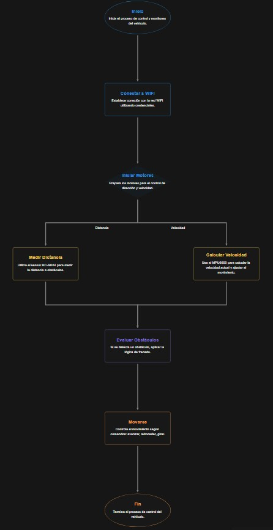
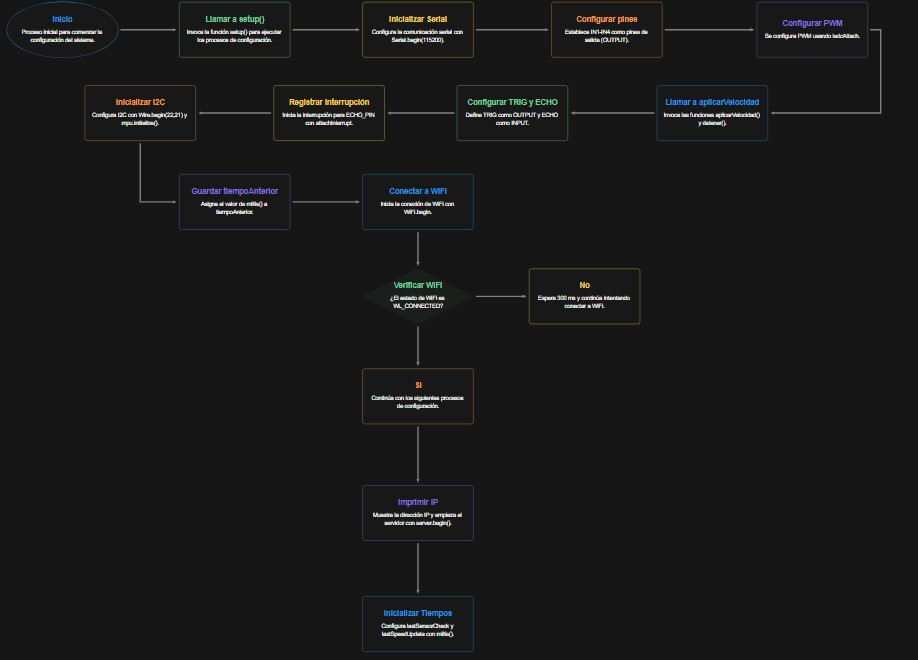
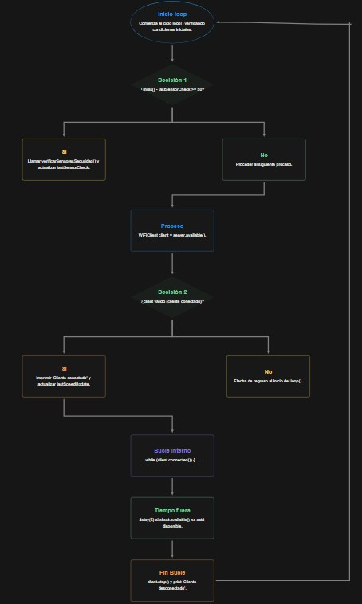

# Documentación de Diseño 
**Proyecto:**  Robot basado en microcontrolador  
**Versión:** 1.0  
**MCU:** ESP32

---

## 2. Arquitectura del software embebido

### 2.1 Módulos

En la arquitectura del software, se encuentran los siguientes módulos:

1. **Comunicación WiFi**
   - Configuración de la red mediante los parámetros de `ssid` y `password`.
   - Un servidor TCP (`WiFiServer server(9000)`).
   - Protocolo de comandos de texto con instrucciones como: FORWARD, BACKWARD y SPEED_SET.

2. **Control de motores (L298N)**
   - Pines digitales de dirección: `IN1`, `IN2`, `IN3`, `IN4`.
   - Canales PWM: `ENA` (usado para la traccióntracción), `ENB` (usado para la dirección).
   - Funciones de alto nivel:
     - `aplicarVelocidad()`
     - `detener()`
     - `avanzar()`
     - `retroceder()`
     - `retrocederAutomatico()`
     - `girarDerecha()`
     - `girarIzquierda()`
   - Estados de movimiento: `moviendoAdelante`, `moviendoAtras`, `girandoDerecha`, `girandoIzquierda`.

3. **Sensor de distancia (HC-SR04)**
   - Pines: `TRIG_PIN`, `ECHO_PIN`.
   - Interrupción `echo_ISR()` sobre flancos del pin ECHO.
   - Captura de tiempos `t_start`, `t_end` y bandera de finalización `pulseDone`.
   - Función de medición no bloqueante: `medirDistancia()`.

4. **Acelerómetro y Giroscopio (MPU6050)**
   - Interfaz I²C (`Wire.begin(22, 21)`).
   - Objeto `MPU6050 mpu`.
   - Cálculo de velocidad: `calcularVelocidad()`.

5. **Lógica de seguridad y control automático**
   - Parámetros:
     - Distancias umbral: `DISTANCIA_INICIO_FRENADO`, `DISTANCIA_DETENCION`, `DISTANCIA_REVERSA`.
     - Velocidad de reversa: `VELOCIDAD_REVERSA`.
   - Estados:
     - `modoFrenadoAutomatico`
     - `modoReversaAutomatica`
     - `velocidadDeseada`, `velocidadOriginal`, `velocidad` (PWM efectiva).
   - Función central: `verificarSensoresSeguridad()`.

6. **Timing**
   - Ticks de sistema con `millis()`:
     - `lastSensorCheck` para sensado/seguridad (cada 50 ms).
     - `lastSpeedUpdate` para telemetría de velocidad (cada 500 ms).

### 2.2 Diagramas de flujo del sistema

Diagrama de funcionamiento general

Diagrama de flujo del setup()

Diagrama de flujo del loop()

Diagrama de la verificación de sensores